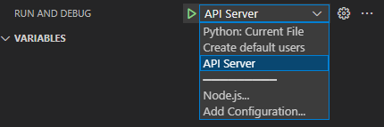

# Howler API

This repo contains the API server for Howler

## Installation instructions

### Dependencies

In order to run howler, you need:

- Python 3.12
- Docker
- Docker Compose
- Recommended: Visual Studio Code
- Pipx (for poetry)
- Poetry

### Setup Howler Folders

```bash
sudo mkdir -p /etc/howler/conf
sudo mkdir -p /var/cache/howler
sudo mkdir -p /var/lib/howler
sudo mkdir -p /var/log/howler

sudo chown -R $USER /etc/howler
sudo chown $USER /var/cache/howler
sudo chown $USER /var/lib/howler
sudo chown $USER /var/log/howler
```

### Setup APT dependencies

```bash
sudo apt update
sudo apt install -yy software-properties-common
sudo add-apt-repository -y ppa:deadsnakes/ppa
sudo apt install -yy python3-venv python3.12 python3.12-dev python3.12-venv
sudo apt install -yy libsasl2-2 build-essential libsasl2-dev libssl-dev zip
```

### Setup pipx/poetry

```bash
pip install pipx
pipx install poetry
```

### Create your virtualenv

```bash
cd ~/repos/howler-api
poetry install --with test,dev,types
poetry shell
```

### Enable pre-commit hooks

This will enable black formatting on commit.

```bash
pre-commit install
```

### Setup default configuration files

Create default classification.yml and config.yml files:

```bash
poetry shell
./generate_howler_conf.sh
```

## Running development environment (VS Code)

Now that the installation instructions are completed, you can now load your `howler-api` folder. We strongly advise installing the recommended extensions when prompted or typing '@recommended' in the Extensions tab.

### Launch dependency containers

You can run the dependency containers either manually in a shell:

```bash
(cd ~/repos/howler-api/dev && docker-compose up)
```

Or directly in VSCode using the tasks in Task Explorer


### Launch the API

Once the dependencies are launched, you can start the API Server. The API server will be loaded with the default configuration found in your `/etc/howler/conf` folder that we've created during the setup. So if you want to enable/disable feature, do it there.

To launch the API server manually you can use this command:

```bash
cd ~/repos/howler-api
poetry run server
```

Launching the API Server manually unfortunately does not give you access to a debugger. If you want to be able to debug you code, you can use the predefined launch target inside of VSCode:



## Running Tests

In order to run the tests, you can use a convenience script:

```bash
# Install test dependencies
poetry install --with test

# Generate mitre lookups
poetry run mitre /etc/howler/lookups

# run the server and the pytest command, along with coverage results
poetry run test
```
