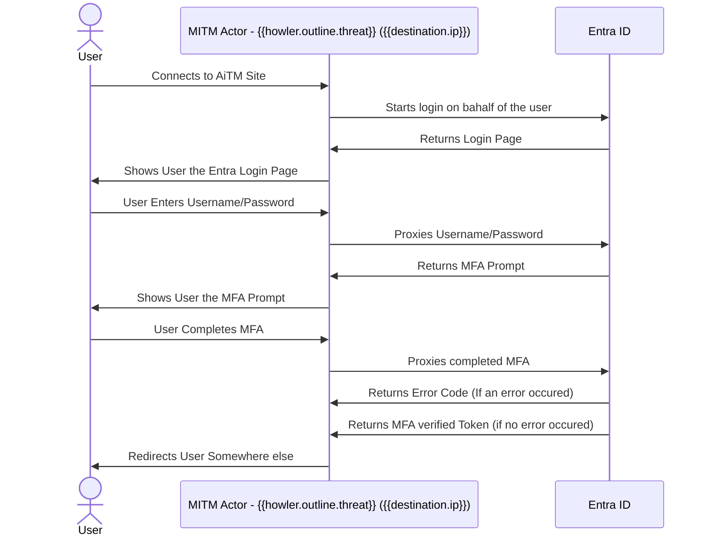

This is an example overview with a detail panel outlining salient details (including enrichment through borealis) of the alert, as well as a basic mermaid diagram.

| **Details** | |
| --- | --- |
| Date Range | 
{{event.start}} TO {{event.end}}
 |
| Threat Domain | 
{{borealis "domain" howler.outline.threat}}
 |
| Threat IP | 
{{borealis "ip" destination.ip}}
 |
| Affected User | 
{{borealis "eml_address" howler.outline.target}}
 |
| User Agent |  
{{user_agent.original}}
 |
| Application | 
{{cloud.service.name}}
 |
| Error | 
{{error.code}} --> {{error.message}}
 |

 

| **Actions** | |
| --- | --- |
| Search for `{{howler.outline.threat}}` | <https://example.com> |
| Look for Emails to `{{howler.outline.target}}` | <https://example.com> |
| Triage Help | <https://example.com> |

 

#### Visualization

