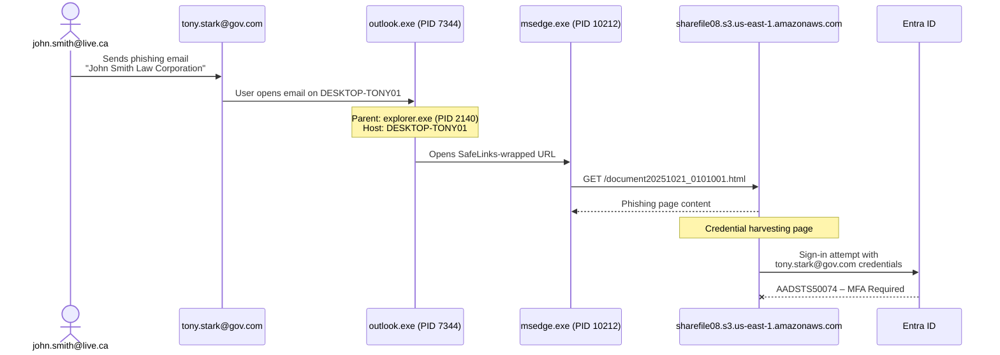
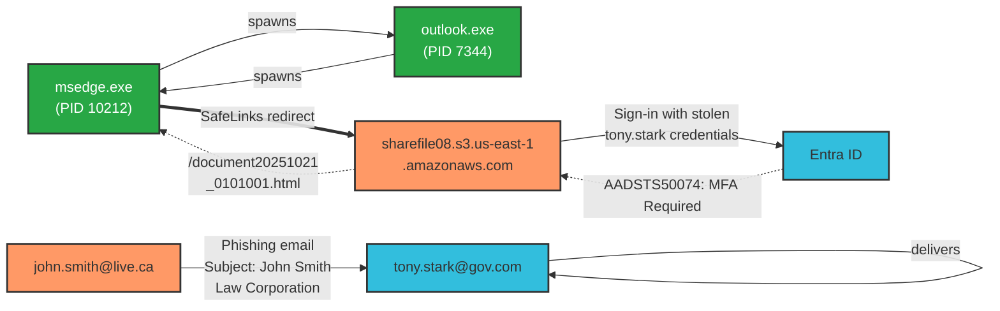

More details

Phishing email from <b>john.smith@live.ca</b> (subject: "John Smith Law Corporation") targeting <b>tony.stark@gov.com</b>. The email contained a malicious link to <code>sharefile08.s3.us-east-1.amazonaws.com/document20251021_0101001.html</code>. On host <b>DESKTOP-TONY01</b>, <code>outlook.exe</code> (PID 7344) spawned <code>msedge.exe</code> (PID 10212) to open the SafeLinks-wrapped phishing URL. The attacker attempted to sign in with the stolen credentials but was blocked by Entra ID with error <b>AADSTS50074 – MFA Required</b>.

<h3>Phishing Email Flow</h3>

<h3>Data</h3>

<table class="table_overview">

<tbody>

<tr>

<td style="padding:8px;font-weight:bold;">Analytic</td>

<td style="padding:8px;">Email Gateway</td>

</tr>

<tr>

<td style="padding:8px;font-weight:bold;">Detection</td>

<td style="padding:8px;">Suspicious Inbound Email</td>

</tr>

<tr>

<td style="padding:8px;font-weight:bold;">Threat</td>

<td style="padding:8px;">john.smith@live.ca</td>

</tr>

<tr>

<td style="padding:8px;font-weight:bold;">Target</td>

<td style="padding:8px;">tony.stark@gov.com</td>

</tr>

<tr>

<td style="padding:8px;font-weight:bold;">Subject</td>

<td style="padding:8px;">John Smith Law Corporation</td>

</tr>

<tr>

<td style="padding:8px;font-weight:bold;">Phishing URL</td>

<td style="padding:8px;">sharefile08.s3.us-east-1.amazonaws.com/document20251021_0101001.html</td>

</tr>

<tr>

<td style="padding:8px;font-weight:bold;">Host</td>

<td style="padding:8px;">DESKTOP-TONY01</td>

</tr>

</tbody>

</table>

<h3>Process Tree &amp; Network</h3>

