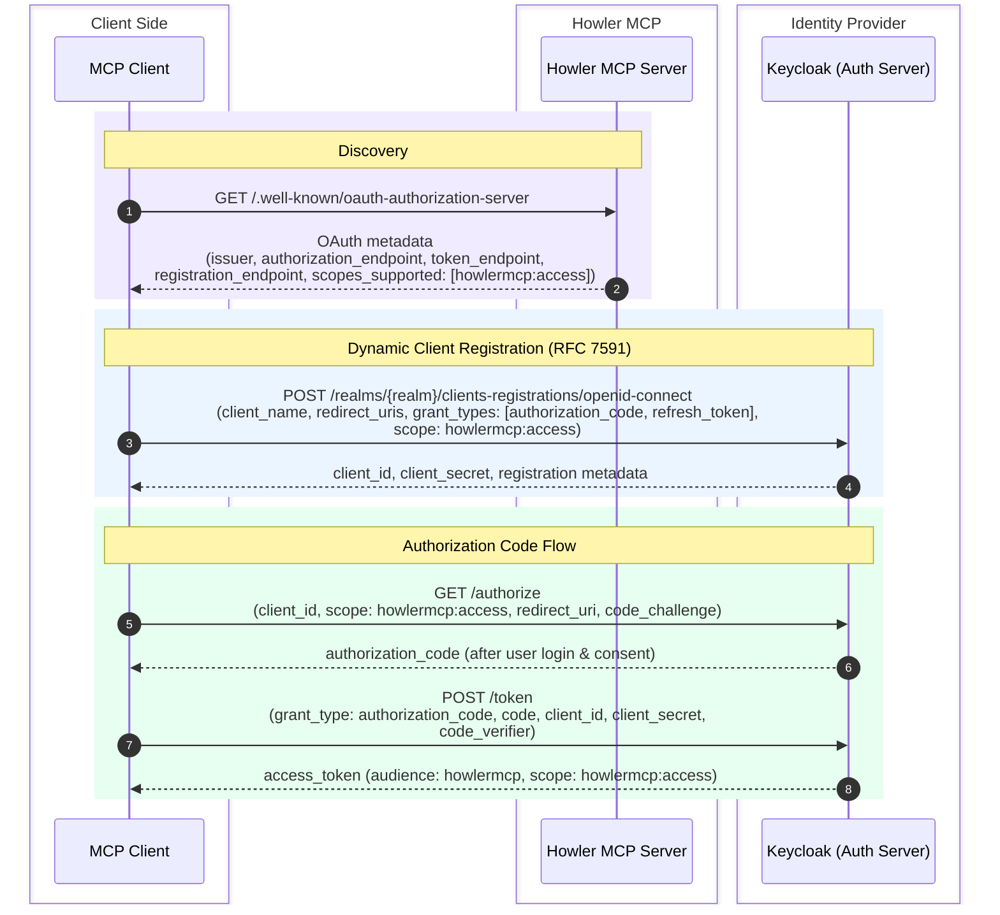
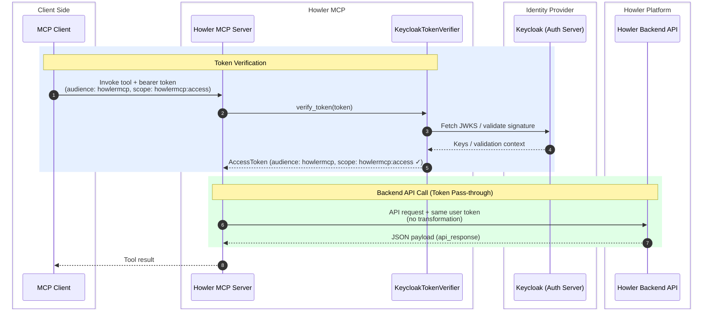

# Howler MCP Server


## What this server does

This MCP server exposes a small set of security triage tools backed by the Howler backend API.

For each tool call, the server:
1. Receives the caller access token from MCP runtime context.
2. Verifies the token signature and required scopes using Keycloak JWKS.
3. Passes the same token to the Howler backend API (token pass-through).
4. Returns the backend payload to the MCP client.

---

## Tools

| Tool | Summary | Value / Impact |
|------|---------|----------------|
| **WhoAmI** | Returns the current user's username, email, groups, and roles. | Lets AI assistants confirm identity and permissions before performing actions, reducing errors from context confusion. |
| **GetHitById** | Retrieves full details for a single hit by its ID. | Enables deep-dive investigation into a specific alert without leaving the conversational interface. |
| **ListAlerts** | Lists hits escalated to "alert" status within a configurable lookback window (default 7 days, limit 25). | Gives analysts an immediate view of active alerts requiring attention, accelerating triage start time. |
| **ListAssignedHits** | Returns all hits currently assigned to the signed-in user. | Surfaces an analyst's personal work queue so they can prioritize without switching to the Howler UI. |
| **SearchHitsWithIndicators** | Searches hits matching one or more indicators (IPs, domains, hashes, etc.) across outline fields. | Powers rapid indicator-based pivoting — critical for threat hunting and incident scoping. |
| **GetFalsePositiveHits** | Returns hits assessed as false positives within a configurable lookback window. | Supports detection engineering by identifying noisy analytics that need tuning. |
| **ListHitsByAnalytic** | Returns hits generated by a specific analytic name within a configurable lookback window (default 30 days). | Helps detection engineers evaluate an analytic's hit volume, quality, and false-positive rate. |
| **AddCommentToHit** | Adds a comment (prefixed with "From MCP Client") to a specific hit. | Enables AI-assisted documentation of findings directly on a hit, keeping the audit trail intact. |

---

## Prompts

| Prompt | Parameters | Summary | Value / Impact |
|--------|------------|---------|----------------|
| **ReviewFalsePositive** | — | Lists all false-positive hits from the last 90 days, analyses the rationale behind each marking, and produces an HTML report with recommendations for reducing false positives. | Drives continuous improvement of detection rules by systematically surfacing tuning opportunities across the analytics portfolio. |
| **HitReview** | `hit_id` | Generates a structured report for a hit including summary, evidence, analyst comments, and next-step recommendations. | Standardizes the review process and accelerates hand-offs between analysts by producing consistent, comprehensive reports. |
| **SearchMatchingIndicatorsInOtherSystem** | `hit_id`, `target_system` | Extracts indicators from a hit, queries a third-party system (e.g., Microsoft Sentinel) for matching alerts, then produces a correlation analysis and action plan. | Bridges visibility gaps between Howler and external SIEMs, enabling cross-platform threat correlation and coordinated response without manual context switching. |

---

## Architecture at a Glance

```
MCP Client (e.g. VS Code, AI Agent)
        │
        ▼
Howler MCP Server (FastMCP, streamable-HTTP)
        │ ← Token verification + pass-through
        ▼
Howler Backend API
```

Every tool call is authenticated: the server validates the caller's JWT signature and required scopes using Keycloak JWKS, then passes the same token to the backend API — ensuring that only authorized clients can access the Howler platform while maintaining full audit traceability.


## Code review

### `server.py`
- Creates the FastMCP application (`FastMCP("Howler MCP")`).
- Configures token verification with `KeycloakTokenVerifier` from `auth.py`.
- Configures MCP auth metadata (`AuthSettings`): issuer URL, resource server URL, and required scopes.
- Creates `HowlerApiClient` and registers tools via `RegisterTools`.
- Starts the server with streamable HTTP transport.

### `auth.py`
- `KeycloakTokenVerifier`:
  - Validates incoming JWT signatures using Keycloak JWKS.
  - Enforces issuer and audience checks.
  - Requires a configured scope (`howlermcp:access`).
  - Converts claims into MCP `AccessToken`.
- `AuthProvider`:
  - Implements token pass-through: returns the verified user token as-is to the backend.
  - No token exchange or transformation occurs — the user token is sufficient for backend API access.

### `api.py`
- `HowlerApiClient` wraps HTTP calls to the backend API.
- Supports `GET`, `POST`, and `OPTIONS` methods.
- Ensures request body is only used with `POST`.
- Exchanges user token through `AuthProvider` before every backend call.
- Returns `api_response` from the backend JSON envelope.

### `tools.py`
Registers **8 MCP tools** and maps them to backend API endpoints:
- `WhoAmI` -> `GET /user/whoami`
- `GetHitById` -> `GET /hit/{hit_id}`
- `ListAlerts` -> `POST /search/hit` (alert escalation query)
- `ListAssignedHits` -> `GET /hit/user`
- `SearchHitsWithIndicators` -> `POST /search/hit` (indicator-based query)
- `GetFalsePositiveHits` -> `POST /search/hit` (false-positive query)
- `ListHitsByAnalytic` -> `POST /search/hit` (analytic name query)
- `AddCommentToHit` -> `POST /hit/{hit_id}/comments`

Also defines typed response models (`WhoAmI_response`, `Howler_response`).

### `prompts.py`
Registers **3 MCP prompts** that generate structured instructions for the AI assistant:
- `ReviewFalsePositive` — produces a false-positive analysis report over 90 days.
- `HitReview` — generates a structured investigation report for a given hit.
- `SearchMatchingIndicatorsInOtherSystem` — cross-correlates hit indicators with a third-party system (e.g., Microsoft Sentinel) and produces an action plan.

### `config.py`
Contains static runtime settings:
- `HOWLER_API`: backend base URL, API version, audience, timeout.
- `AUTH`: Keycloak host/realm/token endpoints and client credentials.
- `MCPSettings`: MCP host/port/base URL.

## Auth flows

### Dynamic Client Registration (DCR)

Before an MCP client can call tools, it must register itself with the authorization server. The MCP server advertises a `registration_endpoint` in its OAuth metadata, which points to Keycloak's RFC 7591 endpoint.



### Token pass-through flow (backend API)

Once the MCP client has an access token, every tool call triggers token verification and pass-through:



  ## Keycloak configuration

  Configure Keycloak in this order to enable token pass-through for this MCP server:

  1. Create a client named `howlermcp`.
  2. Create a scope named `howlermcp:access` and assign it to users who will use this server.
  3. Ensure the `howler` backend client accepts tokens from the MCP client (verify token audience validation is configured correctly).

  This setup matches the server behavior in `auth.py`, `server.py`, and `config.py`:
  - Incoming tokens must include the expected audience (`howlermcp`) and `howlermcp:access` scope.
  - The token is passed through to the backend unchanged — the user token itself must already be valid for the Howler API.

## Run locally

From `mcp/howler_mcp/mcp_server/`:

```bash
cd ../..  # Go to mcp root
PYTHONPATH=. poetry install
PYTHONPATH=. poetry run python howler_mcp/mcp_server/server.py
```

The server listens with streamable HTTP transport and uses values defined in `config.py`. Environment variables override defaults.

## Notes

- Sensitive credentials (e.g., `AUTH_CLIENT_SECRET`) must be set via environment variables; no defaults should be used in production.
- For production use, move all secrets and host values to a secret manager or environment.
