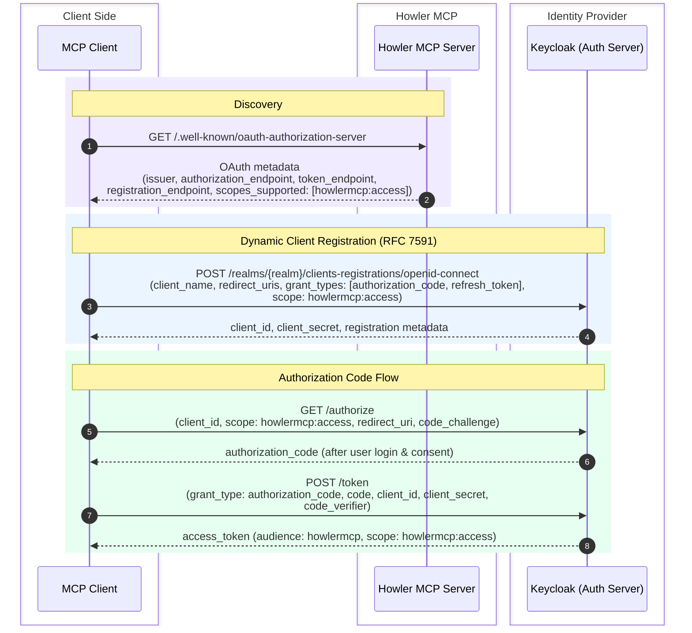
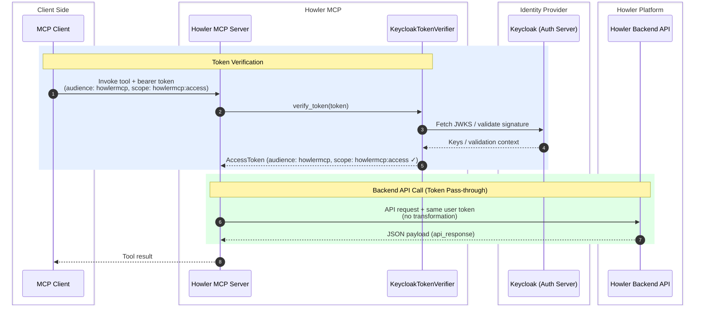

# Howler MCP Server


## What this server does

This MCP server exposes a small set of security triage tools backed by the Howler backend API.

For each tool call, the server:
1. Receives the caller access token from MCP runtime context.
2. Verifies the token signature and required scopes using Keycloak JWKS.
3. Passes the same token to the Howler backend API (token pass-through).
4. Returns the backend payload to the MCP client.

---

## Tools

| Tool | Summary | Value / Impact |
|------|---------|----------------|
| **WhoAmI** | Returns the current user's username, email, groups, and roles. | Lets AI assistants confirm identity and permissions before performing actions, reducing errors from context confusion. |
| **GetHitById** | Retrieves full details for a single hit by its ID. | Enables deep-dive investigation into a specific alert without leaving the conversational interface. |
| **ListAlerts** | Lists hits escalated to "alert" status within a configurable lookback window (default 7 days, limit 25). | Gives analysts an immediate view of active alerts requiring attention, accelerating triage start time. |
| **ListAssignedHits** | Returns all hits currently assigned to the signed-in user. | Surfaces an analyst's personal work queue so they can prioritize without switching to the Howler UI. |
| **SearchHitsWithIndicators** | Searches hits matching one or more indicators (IPs, domains, hashes, etc.) across outline fields. | Powers rapid indicator-based pivoting — critical for threat hunting and incident scoping. |
| **GetFalsePositiveHits** | Returns hits assessed as false positives within a configurable lookback window. | Supports detection engineering by identifying noisy analytics that need tuning. |
| **ListHitsByAnalytic** | Returns hits generated by a specific analytic name within a configurable lookback window (default 30 days). | Helps detection engineers evaluate an analytic's hit volume, quality, and false-positive rate. |
| **AddCommentToHit** | Adds a comment (prefixed with "From MCP Client") to a specific hit. | Enables AI-assisted documentation of findings directly on a hit, keeping the audit trail intact. |

---

## Prompts

| Prompt | Parameters | Summary | Value / Impact |
|--------|------------|---------|----------------|
| **ReviewFalsePositive** | — | Lists all false-positive hits from the last 90 days, analyses the rationale behind each marking, and produces an HTML report with recommendations for reducing false positives. | Drives continuous improvement of detection rules by systematically surfacing tuning opportunities across the analytics portfolio. |
| **HitReview** | `hit_id` | Generates a structured report for a hit including summary, evidence, analyst comments, and next-step recommendations. | Standardizes the review process and accelerates hand-offs between analysts by producing consistent, comprehensive reports. |
| **SearchMatchingIndicatorsInOtherSystem** | `hit_id`, `target_system` | Extracts indicators from a hit, queries the selected third-party system for matching alerts/incidents, then produces a correlation analysis and action plan. | Bridges visibility gaps between Howler and external SIEMs, enabling cross-platform threat correlation and coordinated response without manual context switching. |

---

## Architecture at a Glance

```
MCP Client (e.g. VS Code, AI Agent)
        │
        ▼
Howler MCP Server (FastMCP, streamable-HTTP)
        │ ← Token verification + pass-through
        ▼
Howler Backend API
```

Every tool call is authenticated: the server validates the caller's JWT signature and required scopes using Keycloak JWKS, then passes the same token to the backend API — ensuring that only authorized clients can access the Howler platform while maintaining full audit traceability.


## Code review

### `server.py`
- Creates the FastMCP application (`FastMCP("Howler MCP")`).
- Configures token verification with `KeycloakTokenVerifier` from `auth.py`.
- Configures MCP auth metadata (`AuthSettings`): issuer URL, resource server URL, and required scopes.
- Creates `HowlerApiClient` and registers tools via `RegisterTools`.
- Starts the server with streamable HTTP transport.

### `auth.py`
- `KeycloakTokenVerifier`:
  - Validates incoming JWT signatures using Keycloak JWKS.
  - Enforces issuer and audience checks.
  - Requires a configured scope (`howlermcp:access`).
  - Converts claims into MCP `AccessToken`.
- `AuthProvider`:
  - Implements token pass-through: returns the verified user token as-is to the backend.
  - No token exchange or transformation occurs — the user token is sufficient for backend API access.

### `api.py`
- `HowlerApiClient` wraps HTTP calls to the backend API.
- Supports `GET`, `POST`, and `OPTIONS` methods.
- Ensures request body is only used with `POST`.
- Exchanges user token through `AuthProvider` before every backend call.
- Returns `api_response` from the backend JSON envelope.

### `tools.py`
Registers **8 MCP tools** and maps them to backend API endpoints:
- `WhoAmI` -> `GET /user/whoami`
- `GetHitById` -> `GET /hit/{hit_id}`
- `ListAlerts` -> `POST /search/hit` (alert escalation query)
- `ListAssignedHits` -> `GET /hit/user`
- `SearchHitsWithIndicators` -> `POST /search/hit` (indicator-based query)
- `GetFalsePositiveHits` -> `POST /search/hit` (false-positive query)
- `ListHitsByAnalytic` -> `POST /search/hit` (analytic name query)
- `AddCommentToHit` -> `POST /hit/{hit_id}/comments`

Also defines typed response models (`WhoAmI_response`, `Howler_response`).

### `prompts.py`
Registers **3 MCP prompts** that generate structured instructions for the AI assistant:
- `ReviewFalsePositive` — produces a false-positive analysis report over 90 days.
- `HitReview` — generates a structured investigation report for a given hit.
- `SearchMatchingIndicatorsInOtherSystem` — cross-correlates hit indicators with a third-party system (e.g., Microsoft Sentinel) and produces an action plan.

### `config.py`
Contains static runtime settings:
- `HOWLER_API`: backend base URL, API version, audience, timeout.
- `AUTH`: Keycloak host/realm/token endpoints and client credentials.
- `MCPSettings`: MCP host/port/base URL.

## Auth flows

### Dynamic Client Registration (DCR)

Before an MCP client can call tools, it must register itself with the authorization server. The MCP server advertises a `registration_endpoint` in its OAuth metadata, which points to Keycloak's RFC 7591 endpoint.



### Token pass-through flow (backend API)

Once the MCP client has an access token, every tool call triggers token verification and pass-through:



## Deployment guide

This section documents a full first-time setup and deployment flow for local validation, containerization, and Kubernetes rollout.

### 1) Runtime prerequisites

- Python 3.12+
- Poetry
- Reachable Howler API
- Reachable Keycloak realm and JWKS endpoint
- Node.js (only if using MCP Inspector)
- Docker and Docker Compose (for container runs)
- Kubernetes access (for cluster deployment)

### 2) Environment model

The server reads settings from environment variables in `config.py`.

Required for real deployments:

| Variable | Purpose | Example |
|---|---|---|
| `HOWLER_API_BASE_URL` | Base URL for Howler API | `http://howler-api:3000/api/v1` |
| `AUTH_ISSUER` | JWT issuer expected by verifier | `https://keycloak.example/realms/howler-realm` |
| `AUTH_JWKS_URI` | JWKS URI for JWT signature verification | `https://keycloak.example/realms/howler-realm/protocol/openid-connect/certs` |
| `MCP_BASE_URL` | Public MCP base URL advertised by server auth metadata | `https://mcp.example/mcp` |
| `MCP_AUDIENCE` | Required token audience | `howlermcp` |
| `MCP_SCOPE` | Required token scope | `howlermcp:access` |

Strongly recommended:

| Variable | Purpose | Example |
|---|---|---|
| `AUTH_CLIENT_ID` | Keycloak client id for MCP | `howlermcp` |
| `AUTH_CLIENT_SECRET` | Required environment variable. Inject from a secret manager (no default). | `${AUTH_CLIENT_SECRET}` |
| `HOWLER_API_TIMEOUT` | Request timeout seconds | `5.0` |
| `MCP_HOST` | Bind address in container/pod | `0.0.0.0` |
| `MCP_PORT` | Listen port | `8000` |

`AUTH_CLIENT_SECRET` must be provided at runtime as an environment variable (or secret-injected env var in Kubernetes/CI). Do not hardcode it in files.

Security expectations:

- Do not commit credentials in files.
- Provide secrets from a secret manager, Kubernetes Secret, or CI secret variables.
- Keep audience and scope aligned between Keycloak, MCP server config, and client token requests.

### 3) Required Keycloak permissions and claims

Configure Keycloak explicitly so issued tokens pass verification in this server and are accepted by Howler backend.

1. Realm and identity setup
- Create/use a realm (example: `howler-realm`).
- Create group `howler_user`.
- Add authorized users to `howler_user`.

2. Client setup for MCP
- Client ID: `howlermcp`
- Client authentication: enabled
- Standard flow: enabled
- Service accounts: enable only if your environment requires service-to-service use

3. Scope and audience
- Create scope `howlermcp:access`.
- Ensure user tokens include audience `howlermcp`.
- Ensure tokens used against backend are accepted by Howler API audience policy.

4. Groups mapper
- Add a Group Membership mapper on `howlermcp`.
- Token claim name: `groups`
- Full group path: off
- Add to access token: on

Expected token claim shape:

    {
      "groups": ["howler_user"]
    }

Important: Current server behavior is token pass-through, not token exchange. The incoming user token is forwarded to the backend after verification.

### 4) Local run (developer validation)

From repository path `howler/mcp`:

    poetry install
    poetry run python -m howler_mcp.server

Why module execution is required:
- The server uses package-relative imports within `howler_mcp`.
- Running with `-m` ensures Python resolves package imports correctly.

### 5) Manual token check

Example token request:

    curl -v -X POST "http://localhost:9100/realms/HogwartsMini/protocol/openid-connect/token" \
      -H "Content-Type: application/x-www-form-urlencoded" \
      -d "grant_type=password" \
      -d "client_id=howlermcp" \
      -d "username=${TEST_AUTH_USERNAME}" \
      -d "password=${TEST_AUTH_PASSWORD}" \
      -d "scope=howlermcp:access"

Use real credentials from environment variables or secret management, never hardcoded defaults.

### 6) Test with MCP Inspector

    npx @modelcontextprotocol/inspector

Connect to MCP endpoint (default local):
- `http://localhost:8000/mcp`

### 7) Network integration tests (opt-in)

These tests are intentionally disabled by default and require explicit environment setup.

    export RUN_MCP_NETWORK_TESTS=1
    export TEST_AUTH_USERNAME="<user>"
    export TEST_AUTH_PASSWORD="<password>"
    export TEST_AUTH_EMAIL="<email>"
    export TEST_AUTH_SCOPE="howlermcp:access"
    PYTHONPATH=. poetry run pytest howler_mcp/unittest/network_connection_test.py -v

### 8) Container deployment

From `howler/mcp`:

    docker build -t howler-mcp-server:latest .
    AUTH_CLIENT_SECRET="<secret-from-vault>" docker compose up -d

Notes:
- `docker-compose.yml` uses host networking in this repository.
- For production, prefer explicit container networking and ingress policy controls.

### 9) Kubernetes deployment checklist

Deploy MCP as a standard Deployment + Service, then expose through ingress/gateway if needed.

Minimum requirements:

1. Secret management
- Store `AUTH_CLIENT_SECRET` (and any sensitive values) in Kubernetes Secrets.
- Inject secrets via `env`/`envFrom`.

2. Network policy
- Allow egress from MCP pod to:
  - Keycloak issuer and JWKS endpoints
  - Howler API endpoint
- Allow ingress from authorized MCP clients or gateway to MCP service port.

3. Service account and RBAC
- No cluster-admin privileges are required.
- Pod only needs default runtime permissions unless your platform adds sidecars/controllers.
- Grant only read access to required namespace secrets/config.

4. Health and rollout
- Add readiness/liveness probes on MCP HTTP endpoint path used in your platform.
- Use rolling update strategy and monitor auth failures in logs.

### 10) Common failure modes

- `401/403` from MCP
  - Token audience does not include `MCP_AUDIENCE`.
  - Token scope missing `MCP_SCOPE`.

- `401/403` from Howler backend
  - Forwarded user token not accepted by backend audience/role policy.

- Signature validation errors
  - `AUTH_ISSUER` and `AUTH_JWKS_URI` mismatch realm or hostname.

- Tests skipped unexpectedly
  - `RUN_MCP_NETWORK_TESTS` not set to `1/true/yes`.
  - Required test env vars not provided.

## Notes

- Sensitive credentials (for example `AUTH_CLIENT_SECRET`) must be injected from secure environment sources.
- Keep this document aligned with `config.py`, `docker-compose.yml`, and Keycloak realm policy changes.
