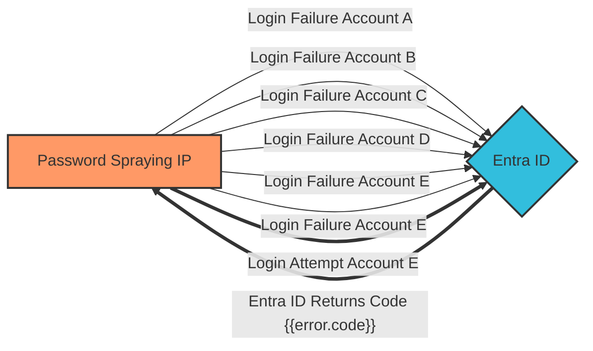

<h3>Actions</h3>

<ul class="actions_list">

<li>

</li>

<li>

</li>

</ul>

<h3>Data</h3>

<table class="table_overview">

<tbody>

<tr>

<td style="padding:8px;font-weight:bold;">Tangent</td>

<td style="padding:8px;">Triangle</td>

</tr>

<tr>

<td style="padding:8px;font-weight:bold;">Start date</td>

<td style="padding:8px;">1</td>

</tr>

<tr>

<td style="padding:8px;font-weight:bold;">End date</td>

<td style="padding:8px;">1</td>

</tr>

<tr>

<td style="padding:8px;font-weight:bold;">Country</td>

<td style="padding:8px;">Canada / Canada / Canada</td>

</tr>

</tbody>

</table>

<h3>Visualization</h3>

